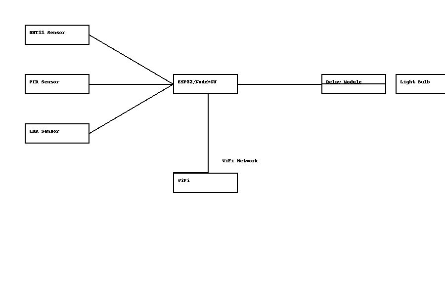

# IoT-Based Home Automation System Using Digital Logic

## Introduction  
This project demonstrates an IoT-based home automation system using Arduino and WiFi modules to control appliances based on real-time sensor data like temperature, humidity, motion, and ambient light.

---

## Objective  
To automate home lighting based on motion detection and light intensity, and monitor environmental parameters using IoT.

---

## Components Used  
- ESP32 / NodeMCU  
- DHT11 Temperature and Humidity Sensor  
- PIR Motion Sensor  
- LDR (Light Dependent Resistor)  
- Relay Module  
- Breadboard & Jumper Wires  
- WiFi Network  

---

## Block Diagram  

---

## Circuit Diagram  

---

## Working  
- **PIR Sensor** detects motion.  
- **LDR** measures light intensity.  
- **Relay Module** controls the connected light.  
- **DHT11** measures temperature and humidity.  
- ESP32 hosts a web server to display real-time sensor readings on a web page.

If motion is detected and light level is below a threshold, the system turns on the light automatically via the relay.

---

## Project Files  

-  [Project Report DOCX](IoT_Home_Automation_Project_Report.docx)  
-  [Arduino Code (main_code.ino)](main_code.ino)  

---

## Features  
- Real-time automation based on environmental factors  
- Web interface for monitoring data  
- Simple and scalable system  

---

## Contact  
For queries, reach out via email at: **rajrrm8654@gmail.com**

---

> *Internship project under Codectechnologies —8 Jun - 8 July 2025*

