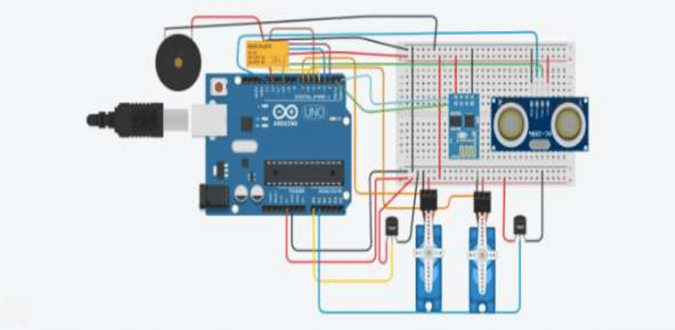

# IoT-Based Home Automation Using Digital Logic

## Overview
This project implements a smart home automation system using ESP32, sensors, digital logic gates, and a Wi-Fi-based remote control dashboard.

## Features
- Motion detection
- Automatic light/fan control
- Temperature monitoring
- Wi-Fi dashboard
- Power optimization

## Components
- ESP32
- PIR Motion Sensor
- DHT11 Temperature Sensor
- LDR Light Sensor
- Relay Module
- Logic Gate ICs (7408, 7432)

## How It Works
Sensors detect environmental changes and send signals to ESP32 via digital logic circuits. The ESP32 then triggers actuators and updates a web dashboard accessible via Wi-Fi.

## Circuit Diagram
## 📌 Breadboard Circuit Image

## Code
See `Code/main_code.ino`

## Author
Rajdeep Raj Mahto

## Contact
rajrrm8654@gmail.com

